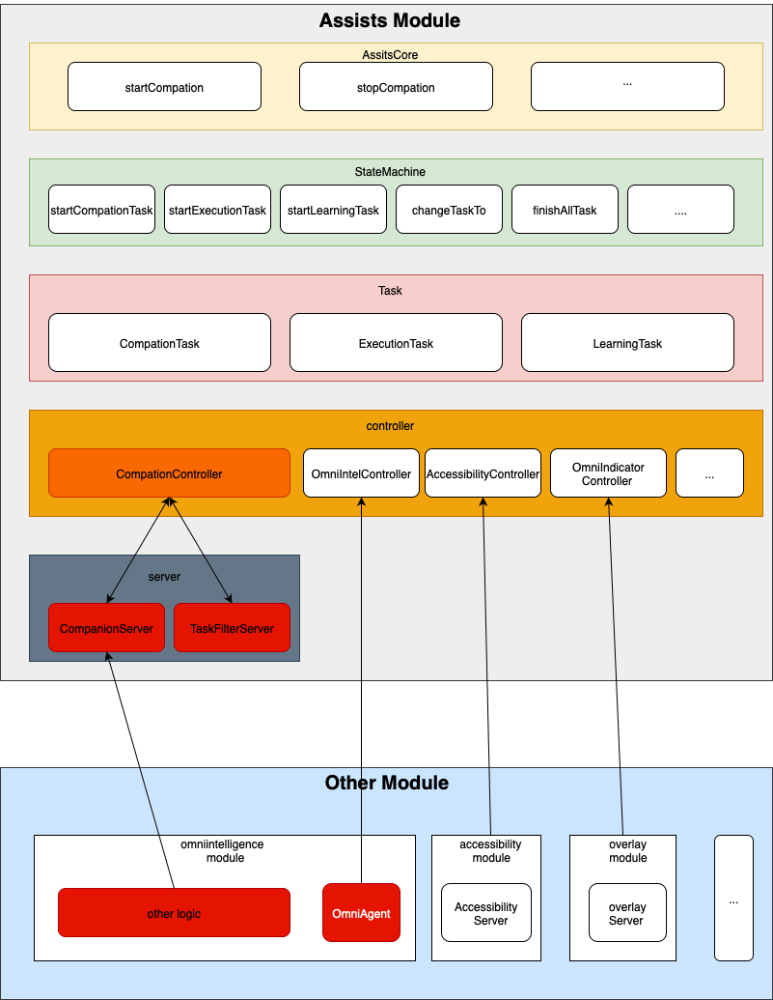

# assists 🤖
## assists 是小万APP中核心的任务代码模块, 负责处理TASK的生命周期, 提供TASK创建回调给UI, 提供TASK状态改变回调给UI, 提供TASK执行结果回调给UI等等
## 🏗️ 架构图

## 项目结构

该项目代码目录结构如下：

- `api`: 主要用户存放一些模型,枚举,监听等
- `controller`: 控制器,为task提供各种功能
- `server`: 研发同学提供的核心服务,主要是不停的获取xml的陪伴模式服务,和基础场景的过滤器
- `task`: 核心任务模块,目前只有陪伴任务,执行任务和学习任务
- `util`:工具类存放
- `AssistsCore`:对外提供的任务创建sdk
- `StateMachine`:状态机,用来控制各种任务的生命周期和状态转换
## 工程团队任务
1.完成架构图中白色块的功能

2.同研发团队同学定义接口或修改参数[CompanionController](src/main/java/cn/com/omnimind/assists/controller/companion/CompanionController.kt)

3.完成陪伴模式下的任务逻辑

4.完成陪伴模式下任务吐出的展示和动效
## 研发团队任务
1.完成[companionServer](/src/main/java/cn/com/omnimind/assists/server/TaskFilterServer.kt)模块(不断获取xml,并向SDK匹配node)

2.完成[原SDK](../omniintelligence)关于[companionServer](/src/main/java/cn/com/omnimind/assists/server/TaskFilterServer.kt)所需逻辑

3.完成[简单场景的过滤](/src/main/java/cn/com/omnimind/assists/server/TaskFilterServer.kt):例如 首次打开支付宝吐出任务列表,进入二级页面后,回到支付宝首页不需要再次吐出任务列表

4.同工程团队同学定义接口或修改参数[CompanionController](src/main/java/cn/com/omnimind/assists/controller/companion/CompanionController.kt)

